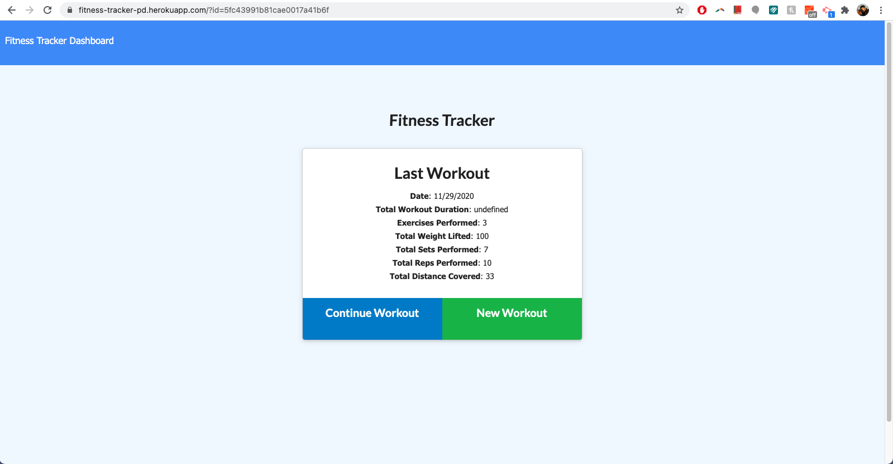
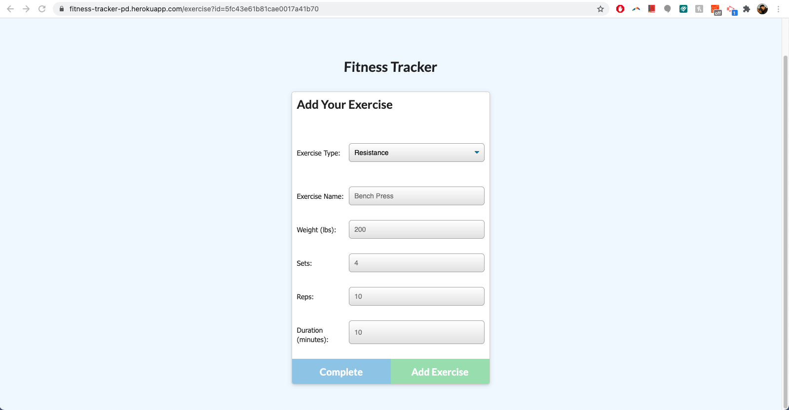
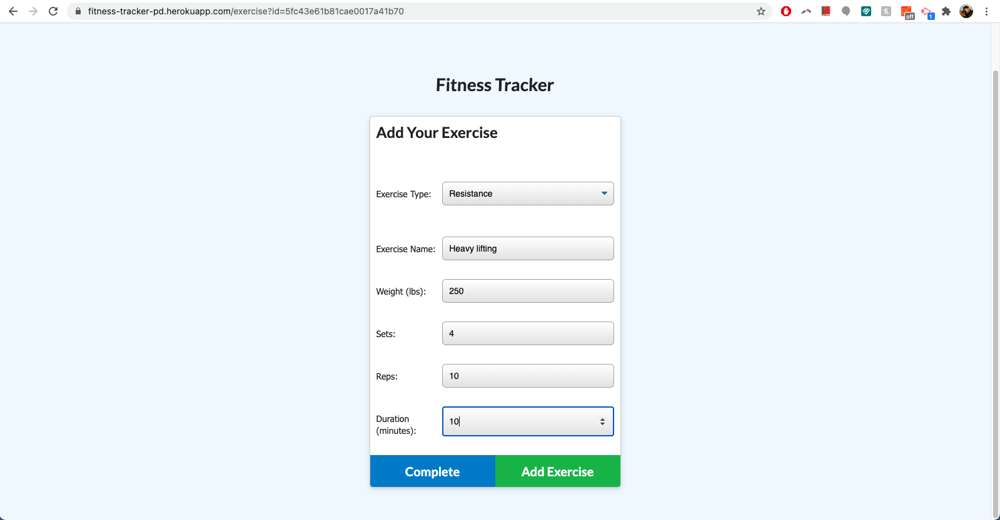
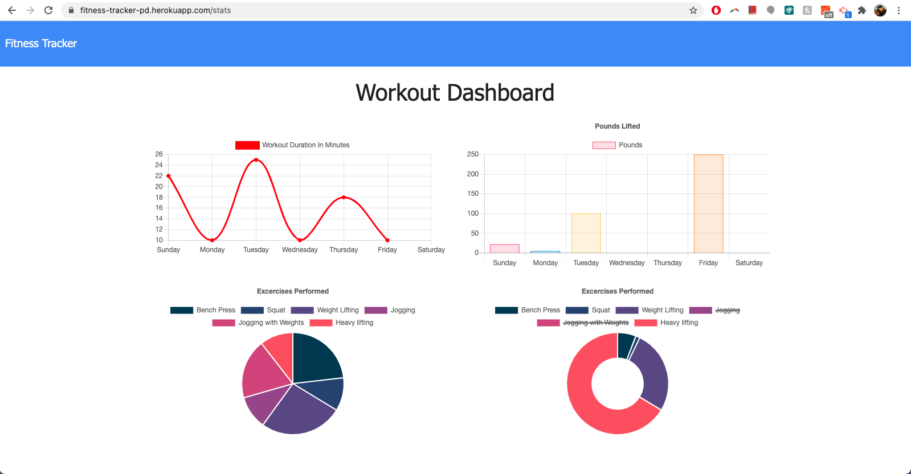
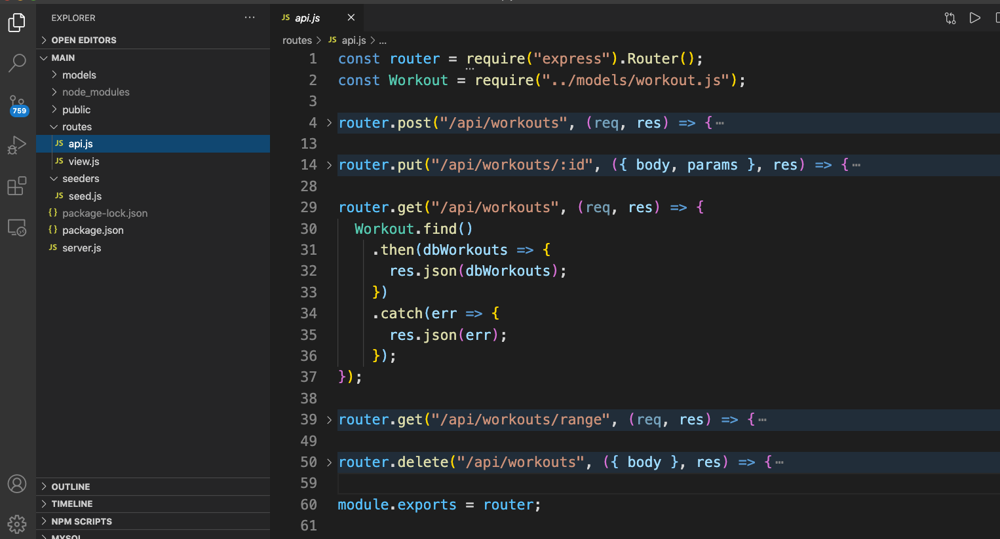

# 🚴 🍌 🚀 Fitness Overload - a workout tracker 🚴 🍌 🚀
[](https://opensource.org/licenses/MIT)

## Description
__Fitness Overload__ app comes in handy for fitness enthusiasts focused on tracking their workout patterns in order to reach out their ultimate fitness objectives faster. The app is essential for all those who want to stay on track of their progress. 

## Table of Contents
* [Installation](#Installation)
* [Usage](#Usage)
* [License](#License)
* [Contributing](#Contributing)
* [Test](#Test)
* [Questions](#Questions)

## Installation
This application will be invoked with the following command:
```
No installation required as this is a browser app deployed on Heroku.
```

## Usage
Decide whether you want to add a new exercise to your current workout or to create a brand new workout. Then choose exercise type (resistance or cardio) and other options from the drop-down menu. By clicking "Add Exercise" you will add the exercise to your current session. By clicking "complete" the current workout session will be ended and you will be taken to the landing page. By clicking the "Dashboard" button on the top of your page you will see two charts with the workout duration and pounds lifted as well as two round graphs with exercises performed (cardio + resistance and resistance only). See the screenshots below for more details.


<p align="center">

</p>

<p align="center">

</p>

<p align="center">

</p>

<p align="center">

</p>

Quick peak at behind-the-scenes API routes...
<p align="center">

</p>

## License
This application is covered under the MIT license.

## Contributing
Let me know if you would like to contibute to this project

## Test
Testing framework used: Under development

## Questions
If you have additional questions, you can reach me via my GitHub profile: [Piotr72us](https://github.com/Piotr72us)<br/>
or send me an email at: piotr72@gmail.com
